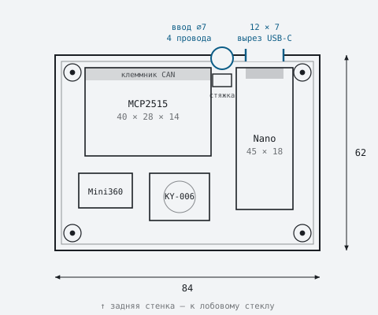
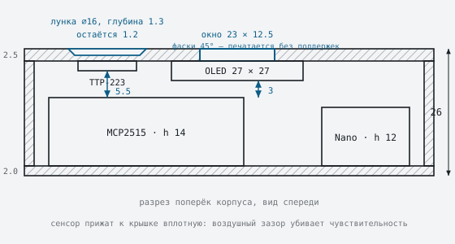
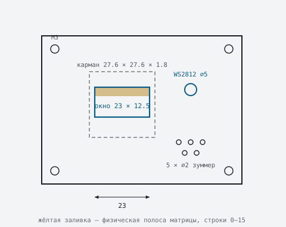
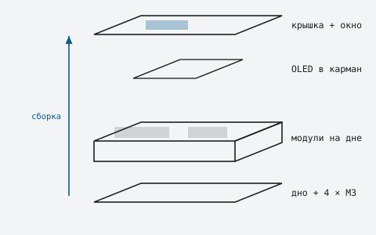

# Корпус под 3D-печать

Компоновочный эскиз. Две печатные детали, четыре винта M3, доступ к USB без
разборки.

| | |
|---|---|
| Габарит | 84 × 62 × 26 мм |
| Стенка | 2.0 мм, крышка 3.0 мм |
| Деталей | 2 печатных + 4 винта M3 |
| Задел | площадка под сенсорную кнопку |
| Материал | PETG или ASA, **не PLA** |
| Масштаб чертежей | 4 px/мм |
| Модель | [cad/enclosure.scad](../cad/enclosure.scad), OpenSCAD |

Форму продиктовало одно ограничение: MCP2515 (40 × 28 мм) и Nano (45 × 18 мм)
вместе занимают почти всю площадь дна, а дисплей 27 × 27 мм не помещается ни
на одну боковую стенку — она всего 26 мм высотой. Отсюда плоская шайба:
модули лежат на дне рядом, дисплей смотрит вверх через крышку.

---

## План дна



**Nano стоит длинной осью поперёк** не из эстетики: разъём USB-C у него на
короткой грани, и только в таком положении он выходит на заднюю стенку. Иначе
для каждой перепрошивки пришлось бы вскрывать корпус. Клеммник MCP2515 тоже
смотрит назад — туда же, куда уходит жгут.

---

## Разрез: почему хватает 26 мм



Крышка 3.0 мм, а не 2.5: карман под дисплей глубиной 1.8 оставлял бы над
окном всего 0.7 мм — три слоя. При 3.0 остаётся 1.2, столько же, сколько под
лункой сенсора. На общую высоту это не влияет, свободного места внутри
хватает с запасом.

Высота набирается из 14 мм самого толстого модуля плюс дисплей под крышкой
плюс зазор. Дисплей утоплен в карман в крышке, а не висит на стойках — так он
не отъедает высоту.

Ключевая деталь: **провода к дисплею паять напрямую, без гребёнки**. Штыревой
разъём добавляет около 10 мм — ровно на них высота и не сходится.

---

## Крышка



Слева — площадка под сенсорную кнопку. Подробности ниже, но главное видно
сразу: **отверстия там нет**. Пунктир на чертеже означает утоньшение стенки,
сплошной контур — сквозной проём.

Жёлтая полоска сверху окна — не украшение. У этой матрицы верхние 16 строк из
64 физически жёлтые, и вёрстка прошивки под это подогнана: там статус и
тревоги (см. `lib/Screen`). Окно должно попадать на активную зону так, чтобы
полоса оказалась сверху, иначе экран будет перевёрнут относительно замысла.

> **Промерьте дисплей перед моделированием.**
> Активная зона не по центру платы: стекло 27 × 27 мм, но светящиеся
> 21.7 × 10.9 мм смещены к одному краю. Замерьте штангенциркулем от края платы
> до края свечения по обеим осям и стройте окно от этого, а не от центра.

---

## Сенсорная кнопка TTP-223

В прошивке кнопка пока не задействована — задел на переключение экранов.
Механику под неё удобнее заложить сразу: переделывать напечатанную крышку
дороже, чем предусмотреть карман.

TTP-223 ёмкостной, и это меняет всю конструкцию узла: **отверстие ему не
нужно**, он срабатывает сквозь пластик. Наружу ничего не выходит, корпус
остаётся герметичным, а на крышке нет ни кнопки, ни щели, куда набьётся пыль.

Взамен появляются три требования.

**Стенку над сенсором надо утоньшить.** Крышка 3.0 мм — для ёмкостного
сенсора это заведомо много. Над пятном должно остаться
**1.2 мм**. Утоньшение делается снаружи лункой — см. следующий пункт, он
закрывает обе задачи разом.

**Модуль прижимается к крышке вплотную.** Воздушный зазор между пятном и
пластиком убивает чувствительность сильнее, чем лишний миллиметр материала.
Двусторонний скотч по краям платы или две печатные защёлки — но пятно должно
лежать на пластике.

**Место касания надо обозначить.** Снаружи ничего не выступает, и вслепую
кнопку не найти.

Решение — **лунка под палец с наружной стороны**: неглубокое круглое
углубление ⌀16 мм на 1.8 мм с плавными краями. Одна деталь делает сразу две
работы: даёт тактильную метку, в которую палец сам попадает и центрируется, и
одновременно **и есть то самое утоньшение** — 3.0 мм крышки минус 1.8 мм
лунки как раз оставляют нужные 1.2 мм. Отдельный карман изнутри при этом не
нужен, а внутренняя поверхность остаётся ровной, к ней проще прижать модуль.

Одна оговорка по геометрии. Сферическая лунка при печати крышкой вниз даёт по
кромке нависание около 70° — край поплывёт. Поэтому в модели делается не
сфера, а **усечённый конус с фасками 45°**: ⌀16 по верху, плоское дно ⌀12.4,
переход 1.8 мм. Пальцем разница не ощущается, а печатается без поддержек.

### Компоновка

Модуль встаёт на крышку слева от дисплея, над платой MCP2515. По разрезу
видно, что он свисает от крышки примерно на 2 мм, а до верха MCP2515 остаётся
**5.5 мм** — конфликта нет.

| | |
|---|---|
| Модуль TTP-223 | 15 × 11 × 2 мм (промерьте свой) |
| Остаётся материала | 1.2 мм |
| Лунка снаружи | ⌀16, глубина 1.8, фаски 45° |
| Зазор до MCP2515 | 5.5 мм |
| Ножка на Nano | D3, зарезервирована в `include/pins.h` |

### Если не сработает

Порядок действий, от простого к сложному:

1. Убедиться, что пятно действительно лежит на пластике без зазора.
2. Утоньшить до 1.0 мм. Ниже 0.8 идти не стоит — на 0.2 мм слое это две
   линии, крышка станет хлипкой в этом месте.
3. Наклеить на пятно кусочек медной или алюминиевой фольги 12 × 12 мм —
   расширенный электрод берёт ёмкость с большей площади. Приём известный и
   работает лучше, чем дальнейшее утоньшение.

Модуль по умолчанию сконфигурирован как «нажал–отпустил» с активным высоким
уровнем — именно это и ожидает `lib/Buttons`, где `digitalRead(...) == HIGH`
означает нажатие. Перемычки режимов на плате трогать не нужно.

---

## Порядок сборки



Дисплей ставится в карман изнутри **до** установки модулей: после того как
дно закрыто, до него уже не добраться.

---

## Спецификация

Габариты типовые — платы разных партий отличаются, свои стоит померить.
MCP2515 встречается и 40 × 28, и 51 × 28; Mini360 бывает 17 × 11 и 18 × 12.

| Компонент | Габарит, мм | Где стоит | Примечание |
|---|---|---|---|
| MCP2515 + TJA1050 | 40 × 28 × 14 | дно, слева сзади | клеммник CAN к задней стенке |
| Arduino Nano | 45 × 18 × 12 | дно, вдоль правой стенки | USB-C выходит на заднюю стенку |
| OLED 0.96″ | 27 × 27 × 4 | карман в крышке | провода паять напрямую |
| Mini360 | 17 × 11 × 4 | дно, слева спереди | настроить на 5 В до подключения |
| KY-006 | 19 × 15 × 9 | дно, по центру спереди | под решёткой в крышке |
| WS2812B | 10 × 10 × 3 | крышка, рядом с окном | под отверстием ⌀5 |
| TTP-223 | 15 × 11 × 2 | крышка, слева от окна | без отверстия, под лункой ⌀16 |

---

## Модель

Параметрическая модель — [cad/enclosure.scad](../cad/enclosure.scad). Исходник
текстовый: правится в любом редакторе, все размеры вынесены в параметры
наверху файла.

```bash
brew install --cask openscad          # если ещё не стоит

openscad -D 'part="shell"' -o shell.stl cad/enclosure.scad
openscad -D 'part="base"'  -o base.stl  cad/enclosure.scad
```

Без аргументов файл открывается в GUI и показывает обе детали рядом.

Промерьте свои платы и поправьте параметры перед печатью. Критичнее всего
`win_dx` / `win_dy` — смещение окна относительно центра платы дисплея, и
`usb_x` / `usb_z0` — положение разъёма, которое у клонов Nano гуляет.

**Печатайте крышку первой и отдельно.** Она несёт все ответственные размеры:
окно, карман, лунку, вырез USB. Проверить их на одной детали за час дешевле,
чем обнаружить промах после печати всего корпуса.

---

## Печать

### PLA здесь не годится

Торпедо под солнцем летом уходит за 70 °C, а PLA размягчается около 55–60.
Корпус поведёт, и он перестанет держать дисплей в кармане. Печатайте **PETG** —
достаточно и просто в работе, — либо **ASA**, если корпус будет на прямом
солнце и хочется запаса по УФ.

### Ориентация на столе

Корпус кладётся **крышкой вниз**. Тогда лицевая поверхность выходит гладкой
прямо со стола, окно дисплея печатается без поддержек, стенки идут
вертикально. Донная пластина печатается плашмя.

Единственное место, требующее внимания, — отверстие кабельного ввода в
вертикальной задней стенке. Круглое ⌀7 нависнет в верхней точке; сделайте его
каплевидным, сведённым сверху под 45° — тогда поддержки не нужны и там.

### Параметры

| Параметр | Значение | Почему |
|---|---|---|
| Слой | 0.2 мм | компромисс скорости и вида лицевой грани |
| Периметры | 3 | 2 мм стенка — ровно три прохода соплом 0.4 |
| Заполнение | 25 % | нагрузок нет, важнее жёсткость крышки |
| Поддержки | нет | при печати крышкой вниз не нужны |
| Крепёж | M3 × 10 самонарез | отверстие в бобышке ⌀2.6, бобышка ⌀6 |

### Что ещё предусмотреть

- **Разгрузка жгута.** Стойка под стяжку внутри, сразу за кабельным вводом.
  Без неё рывок за провод вырывает клеммник из MCP2515.
- **Вентиляция.** Несколько прорезей в донной пластине под Mini360 — он
  единственный, что заметно греется.
- **Крепление.** Площадка под 3M VHB на дне либо паз под клипсу дефлектора.
  При печати дна плашмя ровная нижняя грань получается сама.
- **Рассеиватель.** В отверстие ⌀5 над светодиодом — капля прозрачного
  термоклея. Иначе видна точка кристалла вместо ровного свечения.
- **Лунка сенсора.** Печатается заодно с крышкой; фаски 45° по кромке
  обязательны, иначе при печати крышкой вниз край поплывёт.
- **Допуск на USB.** У клонов Nano разъём смещён от партии к партии. Заложите
  вырез с запасом 1 мм по сторонам либо промерьте свою плату до печати.

### Угол обзора

Корпус нарисован плоским. Если поставить его на торпедо, экран будет смотреть
в потолок. Наклон практичнее печатать отдельным клином под низ, чем встраивать
в корпус: угол на разных панелях нужен разный, а клин переделать — двадцать
минут печати против переделки всей модели.
