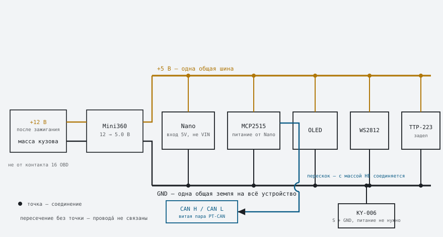

# Схема подключения и сборка

Итоговая распайка устройства: дисплей, CAN, зуммер, светодиод и сенсорная
кнопка. Здесь же — чем отличается отладка на столе от штатной установки.

---

## Земля одна на всё устройство

Короткий ответ на частый вопрос: **в устройстве ровно одна земля**. GND
Arduino, GND модуля MCP2515, GND дисплея, зуммера, светодиода и масса кузова
автомобиля — это всё **один и тот же провод**. Отдельной «земли CAN» не
существует.

**CAN H и CAN L землёй не являются.** Это дифференциальная пара: приёмник
смотрит на разность напряжений между ними, а не на их уровень относительно
массы. Соединять их с землёй нельзя ни при каких обстоятельствах.

Тогда зачем масса вообще нужна, если сигнал дифференциальный? Затем, что
трансиверу TJA1050 нужна собственная точка отсчёта, попадающая в допустимый
диапазон синфазного напряжения шины. Без общей массы с машиной потенциал
устройства «плавает», и трансивер выходит за этот диапазон — связи не будет
либо она будет рваться.



Отсюда и ответ про питание: **MCP2515 питается от Arduino**, а не от шины.
Шина CAN не несёт питания вообще, в ней только два сигнальных провода.

---

## Цепочка питания

```
+12 В (после зажигания) ──→ Mini360 ──→ 5.0 В ──→ Nano (вывод 5V)
                                                     │
масса кузова ───────────→ Mini360 ──→ GND ───────────┴──→ всё остальное
```

Ко всем модулям питание приходит **с Arduino**, а не отдельными проводами от
преобразователя. Так проще разводка и гарантированно одна земля.

| От | К | Примечание |
|---|---|---|
| +12 В после зажигания | Mini360 `IN+` | не от постоянного плюса, см. предупреждение |
| масса кузова | Mini360 `IN−` | |
| Mini360 `OUT+` | Nano `5V` | **не в `VIN`** |
| Mini360 `OUT−` | Nano `GND` | |

Вывод `VIN` рассчитан на 7–12 В и идёт через встроенный стабилизатор. Подавать
на него 5 В нельзя: стабилизатор потеряет на себе около полутора вольт, и
Arduino получит 3.5 В. Готовые 5 В подаются прямо на вывод `5V`.

---

## Полная распайка

### Nano → MCP2515

| Nano | MCP2515 |
|---|---|
| `5V` | `VCC` |
| `GND` | `GND` |
| `D10` | `CS` |
| `D11` | `SI` |
| `D12` | `SO` |
| `D13` | `SCK` |
| `D2` | `INT` |

`D11`, `D12`, `D13` — аппаратный SPI, переназначить их нельзя. `D2` нужен
именно потому, что это вход внешнего прерывания.

### Nano → OLED

| Nano | OLED |
|---|---|
| `5V` | `VCC` |
| `GND` | `GND` |
| `A4` | `SDA` |
| `A5` | `SCL` |

Провода паяются к плате дисплея напрямую, без гребёнки — она добавляет около
10 мм высоты, которых в корпусе нет.

### Nano → WS2812B

| Nano | WS2812B |
|---|---|
| `5V` | `VCC` / `5V` |
| `GND` | `GND` |
| `D6` | `DIN` |

Светодиод один. У ленты есть вход `DIN` и выход `DOUT` — подключается вход.

### Nano → KY-006 (зуммер)

| Nano | KY-006 |
|---|---|
| `D9` | `S` |
| `GND` | `−` |

Питание зуммеру не нужно: он пассивный, звук получается прямо из меандра на
сигнальном выводе. Средний вывод на большинстве плат не подключён.

### Nano → TTP-223 (задел, в прошивке не используется)

| Nano | TTP-223 |
|---|---|
| `5V` | `VCC` |
| `GND` | `GND` |
| `D3` | `I/O` |

### MCP2515 → автомобиль

| MCP2515 | Машина |
|---|---|
| `CANH` | CAN High шины PT-CAN |
| `CANL` | CAN Low шины PT-CAN |

Как найти пару и куда подключаться — в [field-test.md](field-test.md).

---

## Что выходит из корпуса

Через кабельный ввод ⌀7 идут **четыре провода**:

| Провод | Куда |
|---|---|
| +12 В | цепь после зажигания |
| GND | масса кузова |
| CAN H | витая пара PT-CAN |
| CAN L | витая пара PT-CAN |

CAN H и CAN L желательно свить между собой — так пара меньше ловит наводки.
Сечения хватит любого монтажного, ток мизерный.

---

## Потребление

| Узел | Ток при 5 В |
|---|---|
| Arduino Nano | ~20 мА |
| MCP2515 + TJA1050 | ~10 мА, кратко больше при передаче |
| OLED | ~15 мА |
| WS2812B, яркость 60/255 | ~10 мА в тревоге, иначе ~1 |
| TTP-223 | ~5 мА |
| **Итого** | **~60 мА** |

Со стороны 12 В это около 30 мА. У Mini360 предел 1.8 А — запас
многократный, греться ему не с чего.

---

## Два режима подключения

### На столе и при разведке шины

Arduino питается **от ноутбука по USB**, Mini360 и 12 В не участвуют вообще.
Но массу машины подключать всё равно нужно — ради общей точки отсчёта для
трансивера.

```
ноутбук USB ──→ Nano (питание)
масса машины ──→ Nano GND
CAN H / CAN L ──→ MCP2515
```

### После установки

USB отключён, питание идёт от машины:

```
+12 В после зажигания ──→ Mini360 ──→ Nano 5V
масса кузова ──────────→ Mini360 ──→ Nano GND
CAN H / CAN L ─────────────────────→ MCP2515
```

> **Не подключайте USB и 12 В одновременно.** На клонах Nano линия USB-питания
> и вывод `5V` связаны без развязки, и два источника начинают бороться друг с
> другом. Перед перепрошивкой снимайте питание с Mini360 — или хотя бы
> вынимайте предохранитель в цепи +12 В.

---

## Порядок первого включения

Каждый шаг проверяет одну вещь. Пропускать нельзя — половина пунктов
существует потому, что обратный порядок сжигает плату.

1. **Настроить Mini360 без нагрузки.** Подать на вход 12 В, покрутить
   подстроечник, добиться на выходе 5.0 В по мультиметру. Только после этого
   подключать Arduino. При обратном порядке на выходе может оказаться входное
   напряжение, и Nano вместе с дисплеем уходит в утиль за секунду.
2. **Проверить терминатор на MCP2515.** Между `CANH` и `CANL` обесточенного
   модуля не должно быть ~120 Ом. Если есть — выпаять, см.
   [field-test.md](field-test.md).
3. **Собрать всё, кроме CAN.** Питание, дисплей, зуммер, светодиод.
   Подать 5 В: дисплей должен показать экран с прочерками и `NO CAN`
   в жёлтой полосе — то есть логика работает, а шины пока нет.
4. **Подключить CAN.** При включённом зажигании прочерки должны смениться
   значениями в течение секунды.

Если на третьем шаге экран пуст — дело в питании или в I2C. Если на четвёртом
остаётся `NO CAN` — MCP2515 не поднялся: кварц, распайка SPI или терминатор.

---

## Предупреждения

### Питание только после зажигания

Контакт 16 колодки OBD и большинство силовых точек в салоне запитаны
**постоянно**. Устройство потребляет около 30 мА от 12 В и в режиме стоянки
не отключается.

У E90 суммарный ток покоя в спящем режиме укладывается примерно в 30–50 мА.
Наши 30 мА удваивают его: машина либо не уснёт как следует, либо посадит
аккумулятор за несколько дней стоянки.

Берите +12 В с цепи, которая обесточивается вместе с зажиганием. Инструкция
к серийному устройству того же назначения предлагает прикуриватель — но
**проверьте свой мультиметром**: на части машин передний прикуриватель запитан
постоянно, и тогда это ровно тот случай, которого мы избегаем. Критерий
простой: выключили зажигание — напряжение должно пропасть.

Если подходящей цепи рядом нет, ставьте выключатель и не забывайте им
пользоваться, но это заведомо хуже.

### Альтернатива: засыпать по тишине на шине

Есть способ обойтись **постоянным плюсом** и не сажать аккумулятор — гасить
устройство программно. Приём подсмотрен у самодельного дисплея на E90
(см. [references.md](references.md)): его блок включается по зажиганию и
выключается, когда шина сообщает об отсутствии ключа.

Нам для этого даже не нужно декодировать состояние ключа. **PT-CAN замолкает,
когда машина засыпает**, так что достаточно правила «нет кадров N секунд →
спать». Не зависит ни от шины, ни от расшифровки конкретных кадров.

Что для этого нужно в прошивке:

1. Считать время с последнего принятого кадра.
2. По превышении порога (разумно 30–60 с) погасить дисплей и светодиод, а
   MCP2515 перевести в спящий режим — у него есть команда `sleep`.
3. Сам ATmega328P усыпить в `SLEEP_MODE_PWR_DOWN` с пробуждением по
   прерыванию от вывода `INT` модуля MCP2515: тот умеет будить контроллер по
   приходу кадра.

В таком режиме потребление падает на порядки: сам MCP2515 в сне берёт
единицы микроампер, ATmega — тоже. Просыпается всё от первого же кадра,
когда машину открыли и шина ожила.

**В прошивке этого пока нет.** Требование питания после зажигания остаётся в
силе; засыпание — задел, если захочется упростить проводку.

### Полярность CAN

Перепутать `CANH` и `CANL` не смертельно — шина просто не поднимется, и на
экране останется `NO CAN`. Если пара найдена верно (около 60 Ом между
проводами при выключенном зажигании), а связи нет — поменяйте местами.

### Устройство передаёт в шину — один запрос в секунду

Раньше прошивка работала в `MCP_LISTENONLY` и физически не могла отправить ни
кадра. С появлением опроса температуры впуска режим сменён на `MCP_NORMAL`:
раз в секунду уходит запрос `30 0A 01` на адрес `0x600` (DME). Всё остальное
по-прежнему читается из широковещания пассивно.

Подробности и обоснование — в [diag-jobs.md](diag-jobs.md).
